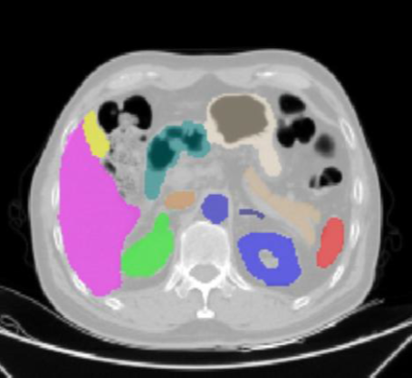
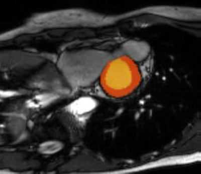
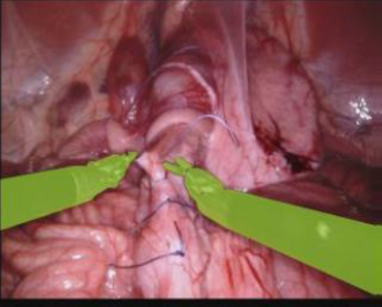
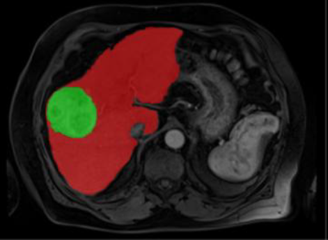

# SAMA-UNet: Self-Adaptive Mamba-like Attention UNet

[](https://www.python.org/downloads/)
[](https://pytorch.org/)
[](LICENSE)

Official PyTorch implementation of **SAMA-UNet**: A novel U-shaped architecture for medical image segmentation that integrates Self-Adaptive Mamba-like Attention and Causal-Resonance Learning.

## 📋 Table of Contents
- [Introduction](#introduction)
- [Key Features](#key-features)
- [Architecture](#architecture)
- [Installation](#installation)
- [Dataset Preparation](#dataset-preparation)
- [Training](#training)
- [Inference](#inference)
- [Results](#results)
- [Citation](#citation)

## 🔬 Introduction

SAMA-UNet addresses the limitations of existing medical image segmentation methods by:
- Combining local and global feature extraction with linear computational complexity
- Preserving causal relationships across multi-scale features
- Achieving state-of-the-art performance on multiple medical imaging modalities (MRI, CT, Endoscopy)

### Key Innovations

1. **SAMA Block**: Self-Adaptive Mamba-like Aggregated Attention block that:
   - Splits features into local and global branches
   - Uses differential attention to suppress irrelevant tokens
   - Achieves linear complexity while maintaining high accuracy

2. **CR-MSM**: Causal-Resonance Multi-Scale Module that:
   - Preserves hierarchical dependencies across scales
   - Uses directional multi-view transformations with State Space Modeling
   - Enhances encoder-decoder feature alignment

## ✨ Key Features

- **High Performance**: SOTA results on BTCV (85.38% DSC), ACDC (92.16% DSC), EndoVis17 (67.14% DSC), and ATLAS23 (84.06% DSC)
- **Computational Efficiency**: Only 29.03M parameters and 145.67 GFLOPs
- **Multi-Modal Support**: Works with CT, MRI, and endoscopy images
- **Flexible Architecture**: Easy to adapt to different datasets and tasks
- **Complete Pipeline**: Training, evaluation, and inference scripts included

## 🏗️ Architecture

### Overall Architecture
```
Input Image → Patch Embedding → SAMA Encoder → CR-MSM Skip Connections → Decoder → Segmentation
```

### SAMA Block Components
- **Token Mixer**: Differential Aggregated Attention (local + global branches)
- **FFN Sub-block**: Feed-forward network with residual connections
- **Mamba-like Macro Structure**: SiLU activation, depthwise convolution, bypass branches

### CR-MSM Components
- **Directional Views**: Original, Transposed, Flipped, Flipped-Transposed
- **SSM Processing**: 2D Selective Scan for long-range dependencies
- **Causal Fusion**: Resonance averaging across orientations

## 🚀 Installation

### Requirements
- Python >= 3.8
- PyTorch >= 2.0.0
- CUDA >= 11.0 (for GPU support)

### Setup

```bash
# Clone the repository
git clone https://github.com/sqbqamar/SAMA-UNet.git
cd SAMA-UNet

# Create virtual environment
python -m venv venv
source venv/bin/activate  # On Windows: venv\Scripts\activate

# Install dependencies
pip install -r requirements.txt
```

### requirements.txt
```
torch>=2.0.0
torchvision>=0.15.0
numpy>=1.21.0
scipy>=1.7.0
nibabel>=3.2.0
opencv-python>=4.5.0
albumentations>=1.3.0
einops>=0.6.0
tensorboard>=2.10.0
tqdm>=4.62.0
matplotlib>=3.5.0
Pillow>=9.0.0
scikit-image>=0.19.0
```

## 📊 Dataset Preparation

### Supported Datasets

#### 1. BTCV (Synapse Multi-Organ Segmentation)
```
data/BTCV/
├── imagesTr/
│   ├── case_0001.nii.gz
│   └── ...
├── labelsTr/
│   ├── case_0001.nii.gz
│   └── ...
├── imagesTs/
└── labelsTs/
```

**Download**: [Synapse Multi-Atlas Challenge](https://www.synapse.org/#!Synapse:syn3193805/wiki/217789)

- **Format**: NIfTI (.nii.gz)
- **Input Size**: 224×224
- **Classes**: 13 organs + background
- **Split**: 18 train / 12 test

#### 2. ACDC (Automated Cardiac Diagnosis Challenge)
```
data/ACDC/
├── patient001/
│   ├── patient001_frame01.nii.gz
│   ├── patient001_frame01_gt.nii.gz
│   └── ...
└── ...
```

**Download**: [ACDC Challenge](https://www.creatis.insa-lyon.fr/Challenge/acdc/)

- **Format**: NIfTI (.nii.gz)
- **Input Size**: 256×224
- **Classes**: 3 cardiac structures + background
- **Split**: 80 train / 20 test

#### 3. EndoVis17 (Surgical Instrument Segmentation)
```
data/EndoVis17/
├── train/
│   ├── video01/
│   │   ├── left_frames/
│   │   └── labels/
│   └── ...
└── test/
    └── ...
```

**Download**: [MICCAI 2017 EndoVis Challenge](https://endovissub2017-roboticinstrumentsegmentation.grand-challenge.org/)

- **Format**: PNG
- **Input Size**: 384×640
- **Classes**: 7 surgical instruments + background
- **Split**: 1800 train / 1200 test frames

#### 4. ATLAS23 (Liver Tumor Segmentation)
```
data/ATLAS23/
├── images/
│   ├── patient001.nii.gz
│   └── ...
└── labels/
    ├── patient001.nii.gz
    └── ...
```

**Download**: [ATLAS Challenge 2023](https://atlas.grand-challenge.org/)

- **Format**: CE-MRI NIfTI (.nii.gz)
- **Input Size**: 320×250
- **Classes**: Liver + Tumor + background
- **Split**: 48 train / 12 test

## 🎓 Training

### Basic Training

```bash
python train.py \
    --dataset BTCV \
    --data_dir ./data/BTCV \
    --output_dir ./outputs \
    --epochs 500 \
    --batch_size 8 \
    --lr 5e-4 \
    --num_workers 4
```

### Training on Different Datasets

#### BTCV
```bash
python train.py \
    --dataset BTCV \
    --data_dir ./data/BTCV \
    --batch_size 8 \
    --lr 5e-4 \
    --epochs 500
```

#### ACDC
```bash
python train.py \
    --dataset ACDC \
    --data_dir ./data/ACDC \
    --batch_size 8 \
    --lr 5e-4 \
    --epochs 500
```

#### EndoVis17
```bash
python train.py \
    --dataset EndoVis17 \
    --data_dir ./data/EndoVis17 \
    --batch_size 4 \
    --lr 1e-4 \
    --epochs 500
```

#### ATLAS23
```bash
python train.py \
    --dataset ATLAS23 \
    --data_dir ./data/ATLAS23 \
    --batch_size 8 \
    --lr 5e-4 \
    --epochs 500
```

### Resume Training

```bash
python train.py \
    --dataset BTCV \
    --data_dir ./data/BTCV \
    --resume ./outputs/BTCV/checkpoints/checkpoint_epoch_100.pth \
    --epochs 500
```

### Training Arguments

| Argument | Type | Default | Description |
|----------|------|---------|-------------|
| `--dataset` | str | BTCV | Dataset name (BTCV/ACDC/EndoVis17/ATLAS23) |
| `--data_dir` | str | required | Path to dataset directory |
| `--output_dir` | str | ./outputs | Output directory for checkpoints |
| `--epochs` | int | 500 | Number of training epochs |
| `--batch_size` | int | 8 | Batch size for training |
| `--lr` | float | 5e-4 | Initial learning rate |
| `--weight_decay` | float | 1e-4 | Weight decay coefficient |
| `--num_workers` | int | 4 | Number of data loading workers |
| `--embed_dims` | list | [96,192,384,768] | Embedding dimensions per stage |
| `--depths` | list | [2,2,2,2] | Number of blocks per stage |
| `--num_heads` | list | [3,6,12,24] | Attention heads per stage |
| `--resume` | str | '' | Path to checkpoint to resume from |
| `--log_interval` | int | 10 | Logging interval (iterations) |
| `--val_interval` | int | 1 | Validation interval (epochs) |

### Monitor Training

Training logs are saved with TensorBoard:

```bash
tensorboard --logdir ./outputs/BTCV/[timestamp]/logs
```

## 🔮 Inference

### Basic Inference

```bash
python predict.py \
    --checkpoint ./outputs/BTCV/checkpoints/best_model.pth \
    --input_dir ./data/test_images \
    --output_dir ./predictions \
    --dataset BTCV
```

### Inference with Evaluation

If ground truth masks are available:

```bash
python predict.py \
    --checkpoint ./outputs/BTCV/checkpoints/best_model.pth \
    --input_dir ./data/test_images \
    --output_dir ./predictions \
    --gt_dir ./data/test_labels \
    --dataset BTCV
```

### Inference with Visualization

```bash
python predict.py \
    --checkpoint ./outputs/BTCV/checkpoints/best_model.pth \
    --input_dir ./data/test_images \
    --output_dir ./predictions \
    --dataset BTCV \
    --visualize \
    --num_vis_samples 10
```

### Inference Arguments

| Argument | Type | Default | Description |
|----------|------|---------|-------------|
| `--checkpoint` | str | required | Path to trained model checkpoint |
| `--input_dir` | str | required | Directory with input images |
| `--output_dir` | str | required | Directory to save predictions |
| `--dataset` | str | BTCV | Dataset name for preprocessing |
| `--gt_dir` | str | '' | Ground truth directory for evaluation |
| `--visualize` | flag | False | Create visualization of predictions |
| `--num_vis_samples` | int | 5 | Number of samples to visualize |

## 📈 Results

### Quantitative Results

Performance comparison on four benchmark datasets (DSC% / NSD%):

| Method | BTCV | ACDC | EndoVis17 | ATLAS23 |
|--------|------|------|-----------|---------|
| **nnUNet** | 84.93 / 87.26 | 91.85 / 96.34 | 62.36 / 63.83 | 80.22 / 85.46 |
| **SwinUNETR** | 78.26 / 78.90 | 91.12 / 94.13 | 57.90 / 59.41 | 79.15 / 82.87 |
| **LKM-UNet** | 84.45 / 87.50 | 89.71 / 92.10 | 62.39 / 63.91 | 81.09 / 85.49 |
| **U-Mamba** | 84.46 / 86.67 | 88.99 / 91.63 | 65.45 / 66.86 | 82.79 / 86.79 |
| **SAMA-UNet (Ours)** | **85.38 / 87.82** | **92.16 / 96.54** | **67.14 / 68.70** | **84.06 / 88.47** |

### BTCV Per-Organ Results

| Organ | DSC (%) | NSD (%) |
|-------|---------|---------|
| Aorta | 91.53 | 95.09 |
| Gallbladder | 68.95 | 69.58 |
| Left Kidney | 87.69 | 88.06 |
| Right Kidney | 86.37 | 88.36 |
| Liver | 95.73 | 94.06 |
| Pancreas | 77.82 | 89.17 |
| Spleen | 92.28 | 93.46 |
| Stomach | 82.71 | 84.76 |
| **Average** | **85.38** | **87.82** |

### Computational Efficiency

| Model | Parameters (M) | GFLOPs |
|-------|----------------|--------|
| nnUNet | 92.48 | 432.13 |
| SwinUNETR | 100.44 | 281.69 |
| LKM-UNet | 189.55 | 993.70 |
| U-Mamba | 76.40 | 554.51 |
| **SAMA-UNet** | **29.03** | **145.67** |

### Qualitative Results

<table>
<tr>
<td width="200">

</td>
<td>
<b>BTCV (Abdominal CT Segmentation)</b><br/>
Multi-organ segmentation showing accurate delineation of liver, spleen, kidneys, pancreas, and other abdominal organs. SAMA-UNet achieves 85.38% DSC and 87.82% NSD, outperforming baseline methods in capturing complex anatomical boundaries.
</td>
</tr>
</table>

<table>
<tr>
<td width="200">

</td>
<td>
<b>ACDC (Cardiac MRI Segmentation)</b><br/>
Cardiac structure segmentation including right ventricle, left ventricle, and myocardium with precise boundary detection. Achieves 92.16% DSC and 96.54% NSD, demonstrating excellent performance on MRI data.
</td>
</tr>
</table>

<table>
<tr>
<td width="200">

</td>
<td>
<b>EndoVis17 (Surgical Instrument Segmentation)</b><br/>
Real-time surgical instrument segmentation in endoscopic images, accurately identifying forceps, scissors, and other tools. Achieves 67.14% DSC and 68.70% NSD on challenging endoscopy data with complex occlusions and reflections.
</td>
</tr>
</table>

<table>
<tr>
<td width="200">

</td>
<td>
<b>ATLAS23 (Liver Tumor Segmentation)</b><br/>
Precise liver and tumor boundary detection in contrast-enhanced MRI, critical for treatment planning. Achieves 84.06% DSC and 88.47% NSD, demonstrating robust performance on tumor segmentation tasks.
</td>
</tr>
</table>

## 🔧 Ablation Studies

### Impact of SAMA Block Components

| Configuration | DSC (%) | NSD (%) | GFLOPs |
|---------------|---------|---------|--------|
| Baseline (SwinUNETR) | 79.13 | 80.10 | 124.2 |
| + Aggregated Attention | 84.30 | 86.70 | 123.8 |
| + Mamba-like Structure | 84.37 | 87.24 | 125.3 |
| + Differential Attention | **84.88** | **87.43** | 125.3 |

### Impact of CR-MSM Components

| Configuration | DSC (%) | NSD (%) |
|---------------|---------|---------|
| Full CR-MSM | **85.38** | **87.82** |
| w/o Multi-view | 85.05 | 87.53 |
| w/o SSM | 84.93 | 87.48 |
| w/o Causal Fusion | 84.85 | 87.51 |

## 📁 Project Structure

```
SAMA-UNet/
├── model.py              # SAMA-UNet architecture
├── dataloader.py         # Dataset classes and dataloaders
├── train.py             # Training script
├── predict.py           # Inference script
├── utils.py             # Utility functions (losses, metrics)
├── requirements.txt     # Python dependencies
├── README.md           # This file
├── results/            # Example results and visualizations
│   ├── btcv_example.png
│   ├── acdc_example.png
│   ├── endovis_example.png
│   └── atlas_example.png
└── data/               # Dataset directory (not included)
    ├── BTCV/
    ├── ACDC/
    ├── EndoVis17/
    └── ATLAS23/
```

## 🛠️ Advanced Usage

### Custom Dataset

To use SAMA-UNet with your own dataset:

1. Create a custom dataset class in `dataloader.py`:

```python
class CustomDataset(Dataset):
    def __init__(self, data_dir, split='train', transform=None):
        # Your implementation
        pass
    
    def __getitem__(self, idx):
        # Return image, label
        pass
```

2. Update `get_dataloader()` function to include your dataset

3. Train with your dataset:

```bash
python train.py --dataset Custom --data_dir ./data/Custom
```

### Fine-tuning

Fine-tune a pre-trained model on your dataset:

```bash
python train.py \
    --dataset YourDataset \
    --data_dir ./data/YourDataset \
    --resume ./pretrained/best_model.pth \
    --lr 1e-5 \
    --epochs 100
```

### Model Architecture Modifications

Adjust model architecture by changing hyperparameters:

```bash
python train.py \
    --embed_dims 64 128 256 512 \
    --depths 3 3 9 3 \
    --num_heads 2 4 8 16
```

## 🐛 Troubleshooting

### Common Issues

**1. CUDA Out of Memory**
- Reduce batch size: `--batch_size 4`
- Reduce model size: `--embed_dims 48 96 192 384`
- Use gradient checkpointing (add to model.py)

**2. Slow Training**
- Increase num_workers: `--num_workers 8`
- Use mixed precision training (add AMP to train.py)
- Ensure data is on SSD, not HDD

**3. Poor Convergence**
- Adjust learning rate: `--lr 1e-4`
- Increase training epochs: `--epochs 800`
- Check data augmentation settings

**4. Installation Issues**
```bash
# If einops fails to install
pip install einops --no-deps

# If nibabel has issues
pip install nibabel --upgrade

# For albumentations compatibility
pip install albumentations==1.3.0
```

## 🤝 Contributing

We welcome contributions! Please:

1. Fork the repository
2. Create a feature branch (`git checkout -b feature/YourFeature`)
3. Commit changes (`git commit -m 'Add YourFeature'`)
4. Push to branch (`git push origin feature/YourFeature`)
5. Open a Pull Request

## 📄 License

This project is licensed under the MIT License - see the [LICENSE](LICENSE) file for details.

## 📚 Citation

If you find this work useful, please cite our paper:

```bibtex
@article{qamar2025sama,
  title={UNet with Self-Adaptive Mamba-Like Attention and Causal-Resonance Learning for Medical Image Segmentation},
  author={Qamar, Saqib and Fazil, Mohd and Ahmad, Parvez and Khan, Shakir and Zamani, Abu Taha},
  journal={arXiv preprint},
  year={2025}
}
```

## 🙏 Acknowledgments

- nnUNet framework for preprocessing strategies
- Mamba and Visual Mamba for architectural inspiration
- The medical imaging community for benchmark datasets

## 📧 Contact

For questions and discussions:
- **Email**: sqamar@su.edu.om
- **GitHub Issues**: [Create an issue](https://github.com/sqbqamar/SAMA-UNet/issues)

## 🔗 Links

- **Paper**: [arXiv](https://arxiv.org)
- **Code**: [GitHub](https://github.com/sqbqamar/SAMA-UNet)
- **Datasets**: 
  - [BTCV](https://www.synapse.org/#!Synapse:syn3193805/wiki/217789)
  - [ACDC](https://www.creatis.insa-lyon.fr/Challenge/acdc/)
  - [EndoVis17](https://endovissub2017-roboticinstrumentsegmentation.grand-challenge.org/)
  - [ATLAS23](https://atlas.grand-challenge.org/)

---

**Last Updated**: September 2025

**Version**: 1.0.0
